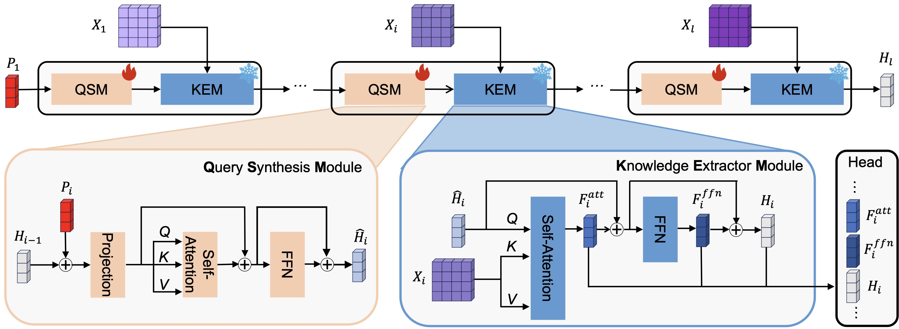

## Parameter-Efficient and Memory-Efficient Tuning for Vision Transformer: A Disentangled Approach

### [[Paper](https://arxiv.org/abs/2402.15648)] 


[Taolin Zhang](https://scholar.google.com/citations?user=DWnu_G0AAAAJ)\*,  [Jiawang Bai](https://scholar.google.com/citations?user=sRksETcAAAAJ)\*, [Zhihe Lu](https://scholar.google.com/citations?user=X4LKIhgAAAAJ), [Dongze Lian](https://scholar.google.com/citations?user=q-C8LqsAAAAJ), GenpingWang, [Xinchao Wang](https://scholar.google.com/citations?user=w69Buq0AAAAJ) and [Shu-Tao Xia](https://scholar.google.com/citations?user=koAXTXgAAAAJ)


(\*) equal contribution

> **Abstract:**  Recent works on parameter-efficient transfer learning (PETL) show the potential to adapt a pre-trained Vision Transformer to downstream recognition tasks with only a few learnable parameters. However, since they usually insert new structures into the pre-trained model, entire intermediate features of that model are changed and thus need to be stored to be involved in back-propagation, resulting in memory-heavy training. We solve this problem from a novel disentangled perspective, i.e., dividing PETL into two aspects: task-specific learning and pre-trained knowledge utilization. Specifically, we synthesize the task-specific query with a learnable and lightweight module, which is independent of the pre-trained model. The synthesized query equipped with task-specific knowledge serves to extract the useful features for downstream tasks from the intermediate representations of the pre-trained model in a query-only manner. Built upon these features, a customized classification head is proposed to make the prediction for the input sample. lightweight architecture and avoids the use of heavy intermediate features for running gradient descent, it demonstrates limited memory usage in training. Extensive experiments manifest that our method achieves state-of-the-art performance under memory constraints, showcasing its applicability in real-world situations.


<p align="center">
    
</p>


## <a name="installation"></a> Installation

This codebase was tested with the following environment configurations. It may work with other versions.

- Python 3.9
- CUDA 11.1
- PyTorch 1.9.0 + cu111

## Datasets
Please follow [VPT](https://github.com/KMnP/vpt/blob/main) to download the VTAB-1K and FGVC benchmarks. 

Note that we utilize images in PNG format, so we have also uploaded the extracted VTAB-1k dataset to [Hugging Face](https://huggingface.co/datasets/iridescentttt/vtab-1k-png) for your convenience. 

## Pretrained Model
Download the pretrained [ViT-B/16](https://storage.googleapis.com/vit_models/imagenet21k/ViT-B_16.npz) to `ckpt/21k.npz`


## <a name="training"></a>  Training

### Fine-tune & Test
Run the following script to fine-tune and test SynQT:
```
bash run.sh $GPU $EXP_NAME $DATASET
```

For example, you can run the a demo test on cifar:  
```
bash run.sh 0 demo cifar
```


## <a name="cite"></a> Citation

Please cite us if our work is useful for your research.

```
@article{zhang2024parameter,
  title={Parameter-Efficient and Memory-Efficient Tuning for Vision Transformer: A Disentangled Approach},
  author={Zhang, Taolin and Bai, Jiawang and Lu, Zhihe and Lian, Dongze and Wang, Genping and Wang, Xinchao and Xia, Shu-Tao},
  journal={arXiv preprint arXiv:2407.06964},
  year={2024}
}
```

## License

This project is released under the [Apache 2.0 license](LICENSE).

## Acknowledgement

This code is based on [VPT](https://github.com/KMnP/vpt/), [Convpass](https://github.com/JieShibo/PETL-ViT) and [SSF](https://github.com/dongzelian/SSF). Thanks for their awesome work.

## Contact

If you have any questions, feel free to approach me at zhangtlin3@gmail.com
